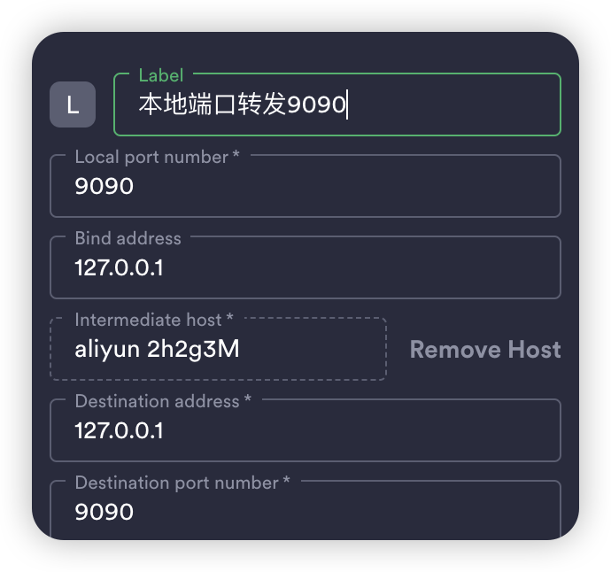

## 一、服务器挂代理

参考教程：https://blog.myxuechao.com/post/36
### 1. 下载安装包
[clash-core](https://github.com/Kuingsmile/clash-core?tab=readme-ov-file) 在 releases中，备份仓库，源clash作者已经删库
   linux 相关的有 3 个安装包:
   + `386`，指的是i386指的是intel80386,32位架构
   + `amd64`，指的是amd的64位架构，新的指令集，支持64位系统
   + `amd64-v3，`指的是使用 golang v3 环境变量，环境变量版本越高,兼容性越差,但性能可能因使用新指令而得到提升

> linux **32 位系统使用 `-386`, 64 位系统默认使用 `-amd64-v3`，如果存在不兼容的情况在使用`-amd64`**
{: .prompt-info }

### 2. 安装包位置

   ```shell
   cd /root
   mkdir clash
   # 下载好文件后直接放在 clash 文件夹里面,我自己下了 clash-linux-amd64-v1.18.0.gz在终端执行 `gunzip  clash-linux-amd64-latest.gz` ，解压.gz文件。
   ```

   2.1 在终端执行 `gunzip  clash-linux-amd64-v1.18.0.gz` ，解压.gz文件

   2.2 将解压后的文件重命名为 `clash`。

   ```shell
   mv clash-linux-amd64-v1.18.0.gz clash #重命名为 clash
   chmod +x clash #赋予 Clash 执行权限
   ```

### 3. 复制订阅链接
   通过订阅链接 获取对应配置文件
   3.1 在终端执行 `wget -O config.yaml` + 刚刚复制的托管链接
   3.2 在终端执行 `./clash -d .` 即可启动 `Clash`

>首次运行之后会在**`当前运行配置目录生成配置文件`，产生的目录为 `/root/clash` ，里面有 `config.yaml` 和 `Country.mmdb` 两个文件。**
{: .prompt-info }

> 或者直接手动复制自己pc上的clash配置文件，`config.yaml` 和 `Country.mmdb` 到/root/clash文件夹下
{: .prompt-tip }

### 4. 修改系统代理(永久)

   ```shell
   cd ~ #切换到 root 账户目录
   ```

   运行 `vi .bashrc`编辑，增加一键开启/关闭 代理函数 到文件末尾

   ```shell
   # 开启代理
   function proxy_on(){
       export all_proxy=socks5://127.0.0.1:7890  # 注意你的端口号可能不是7890，注意修改
       export http_proxy=http://127.0.0.1:7890
       export https_proxy=http://127.0.0.1:7890
       echo -e "已开启代理"
   }
   
   # 关闭代理
   function proxy_off(){
       unset all_proxy
       unset http_proxy
       unset https_proxy
       echo -e "已关闭代理"
   }
   ```

   重新加载终端配置文件

   ```shell
   source ~/.bashrc
   ```

   使用函数

   ```shell
   #在终端输入 proxy_on 代表使用代理
   proxy_on
   #在终端输入 proxy_off 代表关闭代理
   proxy_off
   ```

   测试：

   ```shell
   env | grep proxy #查看代理的地址
   curl https://www.google.com # 测试代理效果
   ```

### 5. 使用守护进程Clash 自启动及后台运行
   5.1 运行`cp clash /usr/local/bin`，可执行文件放入 bin 目录 使全局可访问
   5.2 创建 `/etc/systemd/system/clash.service`

   ```shell
   [Unit]
   Description=Clash daemon, A rule-based proxy in Go.
   After=network.target
   
   [Service]
   Type=simple
   Restart=always
   ExecStart=/usr/local/bin/clash -d   /root/clash
   
   [Install]
   WantedBy=multi-user.target
   ```

   1. 运行 `systemctl enable clash`设置 clash 服务在系统启动时运行；

   2. 运行 `systemctl start clash`立即运行 clash 服务；

   3. 运行 `systemctl status clash`查看 clash 服务运行状态；

   4. 运行 `systemctl stop clash` 停止服务

   5. 运行 `systemctl restart clash` **重启服务**

   6. 运行 `systemctl is-enabled clash` **查看服务是否正在运行**

   7. 运行 `journalctl -xe`查看运行日志；

> 利用 systemd 创建守护进程，关键在于ExecStart执行命令 -d 和/root/clash都是执行clash文件的参数
{: .prompt-danger }

### 6. 配置Clash可视化 web 页面控制

   6.1 下载面板文件

   ```shell
   # 1.切换到 /root/clash/文件夹里
   cd /root/clash/
   # 2.下载 ui
   wget https://github.com/haishanh/yacd/archive/gh-pages.zip
   # 3.解压
   unzip gh-pages.zip
   # 4.修改文件名为 dashboard
   mv yacd-gh-pages/ dashboard/
   ```

   6.2 修改/root/clash/ 下的config.yaml

   - `secret`就是`api的访问秘钥` 如果没有的话任何人都可以访问你的clash面板的api 不安全
   - 这里的 `port` 是 http/https 代理端口
   - `socks-port` 是 socks 流量代理端口
   - `external-controller` 是外部控制端口，用于面板控制(前端页面的端口)
   - `external-ui` 是本地控制页面的源码（前端面板的路由）

   ```yaml
   port: 7890
   socks-port: 7891
   secret: 123456789
   external-controller: 0.0.0.0:9090  #别忘记在服务器厂商开放端口号
   external-ui: dashboard  #打开面板
   ```

   6.3 重启服务

   ```shell
   systemctl restart clash
   ```

   6.4 访问页面 : 宿主机 ip + 9090/ui

   API base URL 是127.0.0.1:9090 ，secret是config.yaml配置文件的字段 ，这2个必填

   + http://<ip>:9090/ui/ （防火墙开启9090，可以访问）
   + 推荐：先使用**本地端口转发**（可以使用vscode插件 remote ssh 插件的 port forward 功能等），再访问 http://127.0.0.1:9090/ui/ 

   

## 二、docker设置代理

对于刚安装的docker 默认官方源，`wget`通过代理服务器连接到Docker Hub，而`docker pull`没有配置代理。你可以在Docker的配置中添加代理设置。

1. 编辑 `/etc/systemd/system/docker.service.d/http-proxy.conf`(如果没有此文件，可以创建):添加以下内容：

   ```ini
   [Service]
   Environment="HTTP_PROXY=http://127.0.0.1:7890"
   Environment="HTTPS_PROXY=http://127.0.0.1:7890"
   ```

2. 保存后，重新加载Docker服务配置并重启Docker服务：

   ```shell
   sudo systemctl daemon-reload
   sudo systemctl restart docker
   ```


原理：为什么服务器设置了代理，Docker还需要配置？
          在服务器上设置了代理时，通常这个代理配置只影响使用标准网络库的程序（如`wget`、`curl`等），而对于Docker这样的服务进程，它不会自动继承或使用这些系统级的代理设置。因此，Docker需要单独配置代理。


