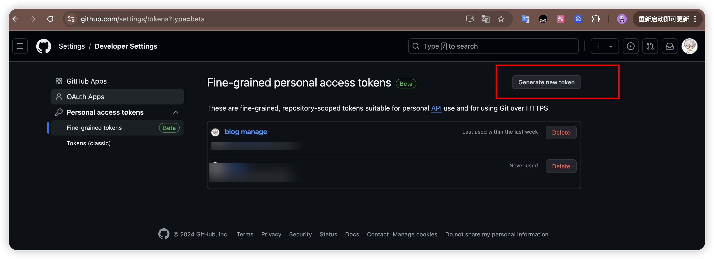
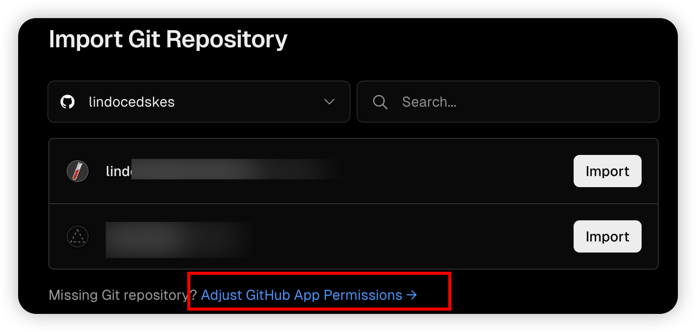
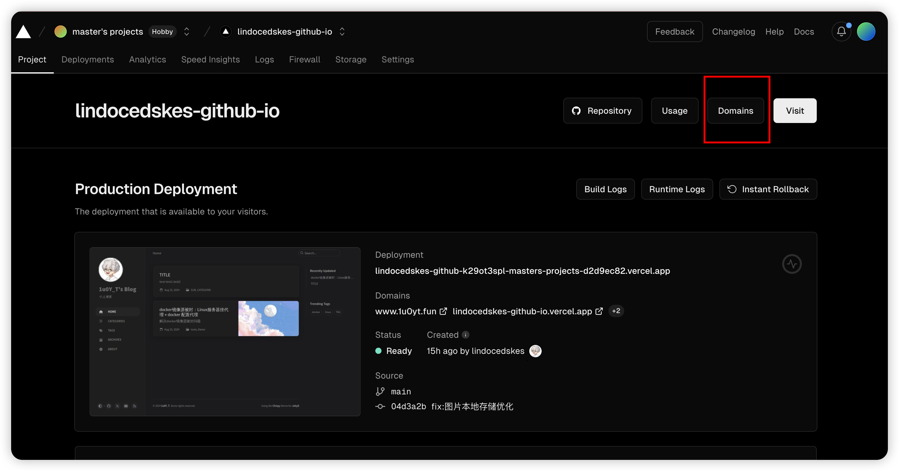
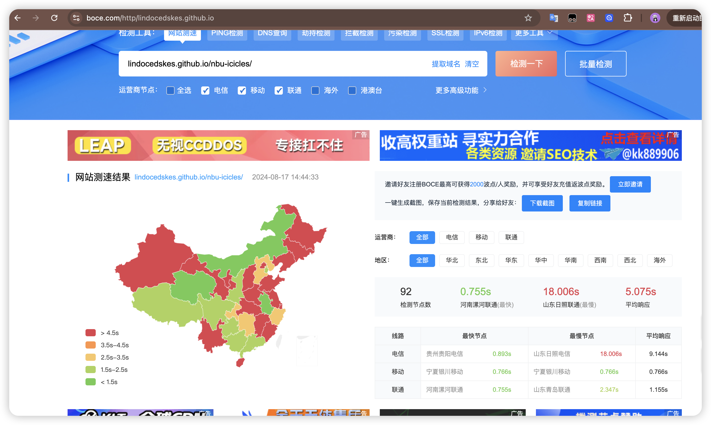
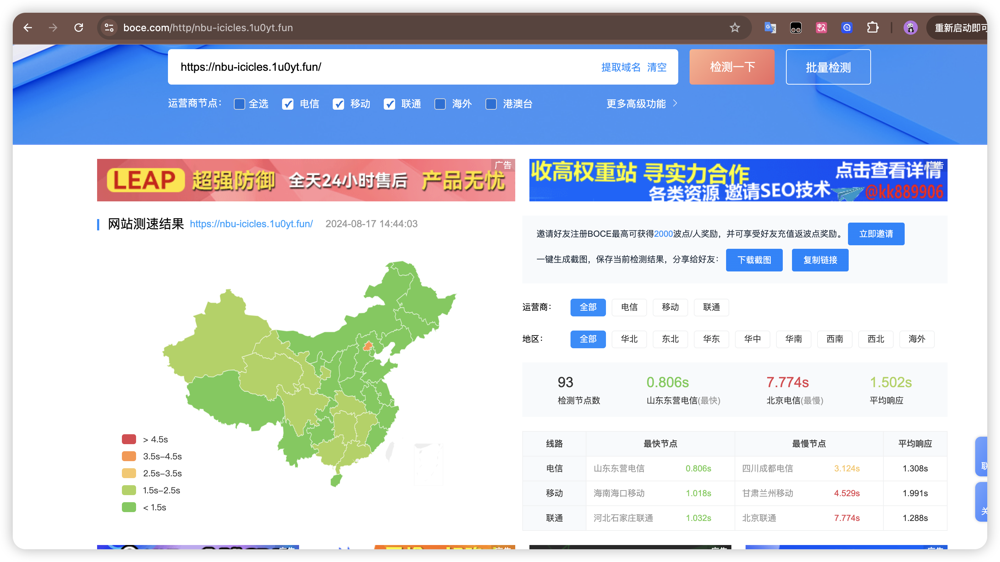

# 搭建Jekyll 静态网站到github + vercel

优点：
+ 无存储成本：使用github搭建博客网站，存储在github上，稳定能持久存储
+ 无需服务器：部署简单，Jekyll可以上github使用temple一键搭建，action自动部署构建
+ 可国内访问： 使用vercel可缓解国内访问github慢的问题，通过vercel在国内的站点进行映射（需要准备一个自己的域名）
+ 其他：静态博客，Jekyll主题丰富，同类型的还有hugo，github也支持，hexo可考虑等。


## 一、jekyll-theme-chirpy 部署到github page上

很简单，使用主题[Chirpy](https://github.com/cotes2020/jekyll-theme-chirpy)，[使用教程](https://chirpy.cotes.page/)见官方网站。
参考中文教程：[zjpzhao.github.io](https://zjpzhao.github.io/posts/jekyll-githubpages/)

记录我直接使用tempalte踩的一些坑：
1. 还需要手动复制四个文件夹`_includes`、`_layout`、`_sass`和`assets`
1. 删除 _config.yml 中 pwa相关（不启用）

### 本地测试
```shell
bundle exec jekyll s
```

### 评论模块使用
评论模块我把[zjpzhao.github.io](https://zjpzhao.github.io/posts/jekyll-githubpages/)中的改为[giscus](https://giscus.app/) 按官网步骤得到的<script>代码放入 _layout/post.html 末尾即可。

### 粘贴图片工具-VSCode插件Paste Image（好用）
按 [参考中文教程](https://zjpzhao.github.io/posts/jekyll-githubpages/#%E7%B2%98%E8%B4%B4%E5%9B%BE%E7%89%87%E5%B7%A5%E5%85%B7-vscode%E6%8F%92%E4%BB%B6paste-image)
踩坑：
1. 直接复制图片文件然后粘贴是不行的,因为要复制图片到剪贴板，所以要打开图片再复制，直接复制应该是复制了文件。
2. settings.json中 图片保存路径参数为"pasteImage.path": "${projectRoot}/assets/img/${currentFileNameWithoutExt}",我去掉了${currentFileNameWithoutExt}改为常量，因为文件名会是中文，**路径有中文会影响在后续vercel的部署**。但仅github pages部署是可以的。

## 二、Vercel托管GitHub Pages并绑定域名
**解决国内直接访问github慢的问题**
参考教程:[Vercel托管GitHub Pages并绑定域名](https://wwwhisperr-github-io.vercel.app/2022/07/25/demo08/)

### 注意：
### 1. 去设置里生成细粒度的token
之后选择Only select repositories 选定赋予权限的仓库，Repository permissions 不懂可以先全部赋予读写权限，Account permissions没必要给。

### 2. vercel 上导入库时要注意给了访问对应库的权限

### 3. _posts文件下的文件名不能包含特殊字符
将作为跳转路径一部分，所以避免包含特殊字符+ ，可用中文，- 。 vercel在build会产生问题，虽然github没事
### 4. 保证部署和本地均能正常显示图片
路径使用 ../assets/img/

## 三、verbal 绑定多个站点
需求：我有一个blog主站对应username.github.io,还有一个从站username.github.io/XXX,分别对应我的2个仓库。我想用二级域名或不同域名访问从站。而不是都在username.github.io对应映射的域名下面。

解决：将/XXX路径，重新做映射
主站根目录下添加vercel.json -username.github.io

```json
{
    "rewrites": [
      {
        "source": "/:match*/",
        "destination": "/:match*"
      },
      {
        "source": "/XXX/:match*",
        //下面这个映射地址要从vercel导入项目后获取，这样访问username.github.io/XXX 就会重新映射
        "destination": "https://XXX.vercel.app/:match*" 
      }
    ],
    "github": {
        "silent": true
    }
  }
```

从站根目录下添加vercel.json -username.github.io/XXX,
```json
{
  "rewrites": [
    {
      "source": "/XXX/:match*",
      "destination": "/:match*"
    }
  ],
  "github": {
      "silent": true
  }
}
```

配置站点域名



之后还是同样参考教程:[Vercel托管GitHub Pages并绑定域名](https://wwwhisperr-github-io.vercel.app/2022/07/25/demo08/#2-%E7%BB%91%E5%AE%9A%E5%9F%9F%E5%90%8D%EF%BC%9A%E8%85%BE%E8%AE%AF%E4%BA%91dns%E8%A7%A3%E6%9E%90%E5%9F%9F%E5%90%8D%E8%87%B3Vercel%E6%8F%90%E4%BE%9B%E7%9A%84IP%E4%B8%8A)

### 直接访问github.io 与 经过vercel加速 的测速对比：

<center class="half">

</center>

## 四、主题用法

发布常用信息头：
```yml
title: docker镜像源被封：Linux服务器挂代理 + docker 配置代理
description: 解决docker镜像源被封问题
author: #有默认值
date: 2024-08-17 12:13:14 +0800
categories:  [Tutorial, blog] #按嵌套分类
tags:  [blog,vercel]     # TAG names should always be lowercase
pin:  # 默认false，可填true
math: true
mermaid: true
image:  #文章封面
  path: /assets/bar/backimg.png #文章封面路径
  lqip: data:image/webp;base64,UklGRpoAAABXRUJQVlA4WAoAAAAQAAAADwAABwAAQUxQSDIAAAARL0AmbZurmr57yyIiqE8oiG0bejIYEQTgqiDA9vqnsUSI6H+oAERp2HZ65qP/VIAWAFZQOCBCAAAA8AEAnQEqEAAIAAVAfCWkAALp8sF8rgRgAP7o9FDvMCkMde9PK7euH5M1m6VWoDXf2FkP3BqV0ZYbO6NA/VFIAAAA
  alt:  # 图片名
```

本地运行：
```shell
bundle exec jekyll server
```

本地图片链接显示：
```shell
../assets/img/2024-08-17/XX.png #使用../assets 保持build前后都能正常显示图片
```


### 进阶：（探索中）

分享其他人的：

+ https://whuwangyong.github.io/2022-03-29-jekyll/

### 架构升级
1. https://github.com/cotes2020/jekyll-theme-chirpy/wiki/Upgrade-Guide
7.2.0 能解决sass 3.0.0 版本不支持原架构导入方式的 build 警告。

2. 更新子模块：
git submodule update --remote
git commit -am "Update submodule"

3. _includes _layouts _sass assetes 四个文件夹复制最新的版本到项目

### 预览图 值生成
预览图失效问题，lqip要手动生成
```yaml
image:
   path: https://thaterrormessage.com/download/file.php?id=884
   lqip: data:image/webp;base64,UklGRpoAAABXRUJQVlA4WAoAAAAQAAAADwAABwAAQUxQSDIAAAARL0AmbZurmr57yyIiqE8oiG0bejIYEQTgqiDA9vqnsUSI6H+oAERp2HZ65qP/VIAWAFZQOCBCAAAA8AEAnQEqEAAIAAVAfCWkAALp8sF8rgRgAP7o9FDvMCkMde9PK7euH5M1m6VWoDXf2FkP3BqV0ZYbO6NA/VFIAAA
   alt:  # 图片名
```

安装 lqip 工具：
```shell
npm install -g lqip
lqip path/to/image.jpg # 执行命令获得值，粘贴到lqip 字段
```