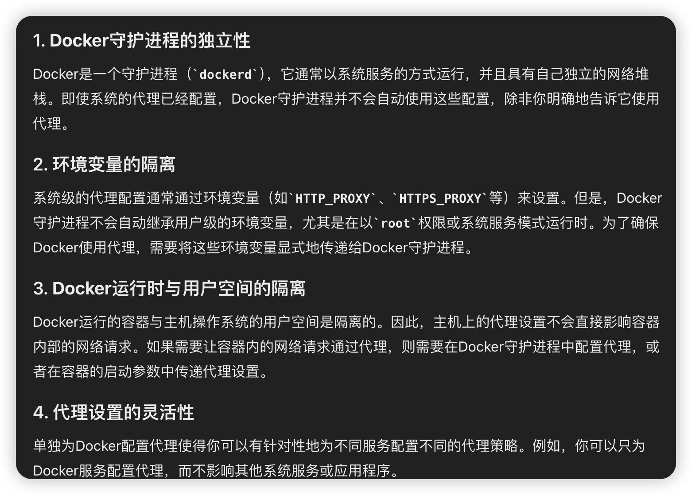

## 前置信息

1. 获取主机上的代理软件运行的端口


2. 虚拟机网络与主机是NAT方式
3. 查看主机ip `ipconfig` 选择VMware Network Adapter VMnet8 对应的ipv4.（虚拟机能ping到的）


##  GUI 下配置
1. 打开右上角，选择Wired Connected 中的Wired Settings ，之后步骤见下图


##  linux终端中配置 （已经安装好了代理）
> export仅对当前终端生效，可写入终端对应配置文件`~/.bashrc` 最后一行使永久生效.在linux 安装代理见 [另一篇文章](/posts/docker镜像源被封-Linux服务器挂代理和docker配置代理/)
{: .prompt-tip }
之前在Debian系统上指定代理的ip+端口，使用如下命令就可以了
```shell
export ALL_PROXY=http://127.0.0.1:7890
```
但在ubuntu22 LTS 中发现export ALL_PROXY后用wget 测试后不行，用下面可以。可能是因为 wget  默认不使用 ALL_PROXY 环境变量
```shell
export http_proxy=http://192.168.130.1:7897
export https_proxy=http://192.168.130.1:7897
```
> export XXX_proxy=http://ip:port ,本文的ip和端口都取决于代理程序运行在哪个主机上和对应端口
{: .prompt-warning }


## docker设置代理

对于刚安装的docker 默认官方源，`wget`通过代理服务器连接到Docker Hub，而`docker pull`没有配置代理。你可以在Docker的配置中添加代理设置。

1. 编辑 `/etc/systemd/system/docker.service.d/http-proxy.conf`(如果没有此文件，可以创建，确保有docker.service.d文件夹):添加以下内容：

   ```ini
   [Service]
   Environment="HTTP_PROXY=http://192.168.130.1:7897"
   Environment="HTTPS_PROXY=http://192.168.130.1:7897"
   ```

2. 保存后，重新加载Docker服务配置并重启Docker服务：

   ```shell
   sudo systemctl daemon-reload
   sudo systemctl restart docker
   ```


原理：为什么Linux设置了代理，Docker还需要配置？
          在Linux上设置了代理时，通常这个代理配置只影响使用标准网络库的程序（如`wget`、`curl`等），而对于Docker这样的服务进程，它不会自动继承或使用这些系统级的代理设置。因此，Docker需要单独配置代理。


